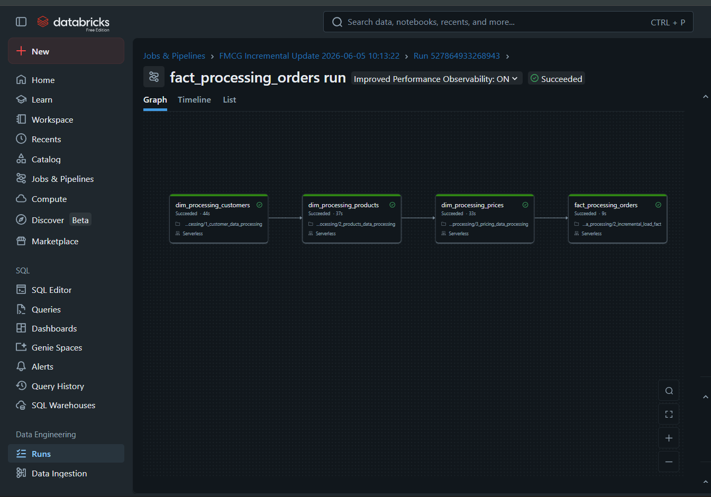
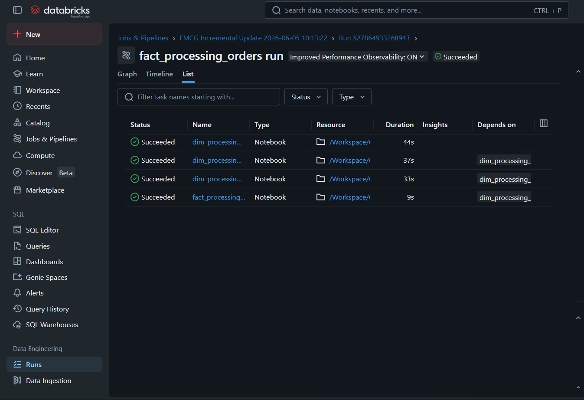
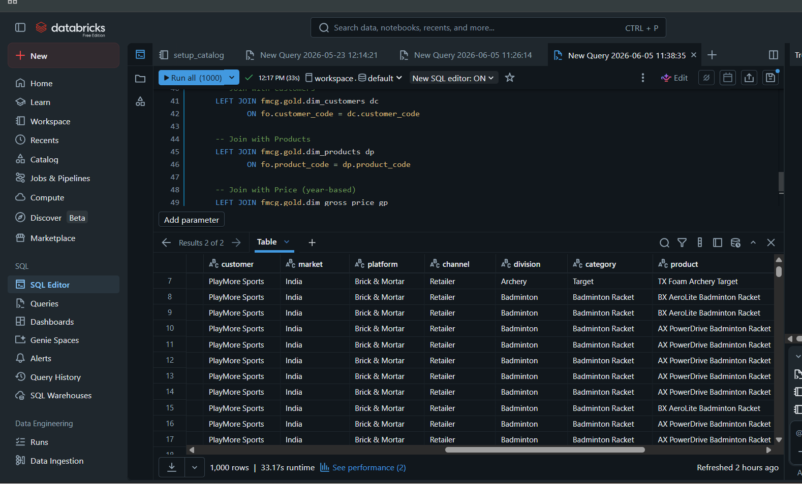

# 🏭 FMCG Data Engineering Pipeline

**End-to-end production-grade data pipeline built on Databricks and AWS S3 — solving a real retail acquisition data consolidation problem using Medallion Architecture (Bronze → Silver → Gold).**

    

---

## 📌 Business Problem

A large FMCG retail company acquires a smaller retail company. Both operate **separate data systems with different formats and structures**.

**The challenge:** How do you consolidate data from two different retail systems into a single, unified analytics platform that business stakeholders can query and report on?

This project builds a production-grade, automated pipeline on **Databricks + AWS S3** to solve exactly this — handling data ingestion, transformation, modeling, and BI reporting end-to-end.

---

## 🏗️ Architecture

```
┌─────────────────────────────────────────────────────────────────┐
│                        DATA SOURCES                             │
│                                                                 │
│   Large Retail Co. (CSV/JSON)    Small Retail Co. (CSV/JSON)    │
└──────────────────┬──────────────────────┬───────────────────────┘
                   │                      │
                   ▼                      ▼
┌─────────────────────────────────────────────────────────────────┐
│                    AWS S3 (Data Lake)                           │
│                   Raw Data Storage                              │
└──────────────────────────────┬──────────────────────────────────┘
                               │
                               ▼
┌─────────────────────────────────────────────────────────────────┐
│                    DATABRICKS PLATFORM                          │
│                  Unity Catalog (fmcg)                           │
│                                                                 │
│  ┌─────────────┐   ┌─────────────┐   ┌─────────────────────┐   │
│  │ 🥉 BRONZE   │ → │ 🥈 SILVER   │ → │    🥇 GOLD          │   │
│  │             │   │             │   │                     │   │
│  │ Raw ingested│   │ Cleaned &   │   │ Star Schema:        │   │
│  │ data from   │   │ standardized│   │ • dim_customers     │   │
│  │ both sources│   │ data        │   │ • dim_products      │   │
│  │             │   │             │   │ • dim_gross_price   │   │
│  │ • customers │   │ Validated   │   │ • dim_date          │   │
│  │ • products  │   │ business    │   │ • fact_orders       │   │
│  │ • orders    │   │ rules       │   │ • vw_fact_orders    │   │
│  │ • gross_price│  │ applied     │   │   _enriched (view)  │   │
│  └─────────────┘   └─────────────┘   └─────────────────────┘   │
│                                                                 │
│         Historical Load              Incremental Load           │
│         (One-time full)              (Delta updates only)       │
└──────────────────────────────┬──────────────────────────────────┘
                               │
                               ▼
┌─────────────────────────────────────────────────────────────────┐
│              BI DASHBOARDS & GENIE SPACES                       │
│         FMCG Sales and Orders Analytics                         │
│   • Revenue trends  • Customer insights  • Product performance  │
└─────────────────────────────────────────────────────────────────┘
```

---

## 🖥️ Pipeline in Action

### Pipeline DAG — All Tasks Succeeded
> Four notebooks running in sequence with dependency chain: customers → products → prices → fact orders



---

### Execution Timeline
> Sequential task execution: `dim_processing_customers` (44s) → `dim_processing_products` (37s) → `dim_processing_prices` (33s) → `fact_processing_orders` (9s)


---

### Task Run List — All Notebooks Succeeded
> Every notebook completed successfully with proper dependency resolution



---

### Gold Layer — SQL Query on Star Schema
> Querying the enriched Gold layer: 1,000 rows returned in 33.17s, joining `fact_orders` with `dim_customers`, `dim_products`, and `dim_gross_price`



---

## 🛠️ Tech Stack

| Technology | Purpose |
|---|---|
| **Databricks** | Cloud data platform — notebooks, compute, Unity Catalog |
| **Apache Spark (PySpark)** | Large-scale distributed data processing |
| **Delta Lake** | ACID-compliant storage layer for reliable data management |
| **Unity Catalog** | Data governance, access control, and metadata management |
| **AWS S3** | Cloud object storage for the data lake |
| **Python** | Pipeline development and transformation logic |
| **SQL** | Data modeling, querying, and analytics |
| **Databricks Genie** | Natural language BI interface for business stakeholders |

---

## 📂 Project Structure

```
databricks-fmcg-data-pipeline/
│
├── setup_catalog.py                  # Unity Catalog setup — creates fmcg catalog, bronze/silver/gold schemas
├── dim_date_table_creation.py        # Generates dim_date table with full date hierarchy
│
├── 1_customer_data_processing.py     # Bronze → Silver: customer data from both companies
├── 2_products_data_processing.py     # Bronze → Silver: product catalog consolidation
├── 3_pricing_data_processing.py      # Bronze → Silver: gross price data transformation
│
├── 1_full_load_fact.py               # Historical full load: fact_orders table
├── 2_incremental_load_fact.py        # Incremental load: processes only new/changed records
│
└── README.md
```

---

## 🔄 Pipeline Stages

### 🥉 Stage 1 — Setup (Run Once)

**`setup_catalog.py`** — Creates the Unity Catalog structure:
- `fmcg` catalog with `bronze`, `silver`, `gold` schemas
- Governs all data access and permissions throughout the pipeline

**`dim_date_table_creation.py`** — Builds a complete date dimension table for time-based analysis across all reports

---

### 🥈 Stage 2 — Dimensional Data Processing (Bronze → Silver)

Processes the three core business entities from both companies:

**`1_customer_data_processing.py`**
- Ingests customer records from both retail companies
- Standardizes names, addresses, and identifiers
- Deduplicates and applies data quality rules
- Output: `silver.customers` — clean, unified customer master

**`2_products_data_processing.py`**
- Consolidates product catalogs from both companies
- Normalizes product codes, categories, and descriptions
- Output: `silver.products` — unified product catalog

**`3_pricing_data_processing.py`**
- Processes gross price data with effective date ranges
- Handles pricing discrepancies between the two companies
- Output: `silver.gross_price` — clean pricing data

---

### 🥇 Stage 3 — Fact Data Processing (Silver → Gold)

**`1_full_load_fact.py`** — Historical load (run once)
- Loads all historical order data from both companies
- Joins with dimension tables to create enriched fact records
- Creates: `gold.fact_orders`, `gold.dim_customers`, `gold.dim_products`, `gold.dim_gross_price`

**`2_incremental_load_fact.py`** — Delta/incremental load (run on schedule)
- Processes only new or changed records since last run
- Uses Delta Lake's change tracking for efficient updates
- Maintains data freshness without full reloads

---

## 📊 Gold Layer — Star Schema

```
                    ┌──────────────────┐
                    │   dim_date       │
                    │ • date_id        │
                    │ • year, month    │
                    │ • quarter, week  │
                    └────────┬─────────┘
                             │
┌──────────────┐    ┌────────┴─────────┐    ┌──────────────────┐
│ dim_customers│    │   fact_orders    │    │  dim_products    │
│ • customer_id│◄───│ • order_id       │───►│ • product_id     │
│ • name       │    │ • customer_id    │    │ • product_name   │
│ • segment    │    │ • product_id     │    │ • category       │
│ • region     │    │ • date_id        │    │ • division       │
└──────────────┘    │ • quantity       │    └──────────────────┘
                    │ • gross_price_id │
                    └────────┬─────────┘
                             │
                    ┌────────┴─────────┐
                    │  dim_gross_price │
                    │ • price_id       │
                    │ • product_id     │
                    │ • gross_price    │
                    │ • effective_date │
                    └──────────────────┘
```

---

## ⚡ Key Concepts Demonstrated

| Concept | Where Used |
|---|---|
| **Medallion Architecture** | Bronze → Silver → Gold layered pipeline |
| **Delta Lake** | ACID transactions, time travel, schema enforcement |
| **Unity Catalog** | Centralized governance across all pipeline stages |
| **Historical Full Load** | One-time ingestion of all existing data |
| **Incremental Load** | Delta processing — only new/changed records |
| **Star Schema Design** | Dimension + fact tables optimized for BI queries |
| **Data Quality** | Validation and cleansing at Silver layer |
| **SCD (Slowly Changing Dimensions)** | Customer and product master data management |

---

## 🚀 How to Run

### Prerequisites
- Databricks workspace (Free Edition works)
- AWS S3 bucket with source data uploaded
- Unity Catalog enabled on your workspace

### Execution Order

```bash
# Step 1 — One-time setup (run only once)
1. setup_catalog.py
2. dim_date_table_creation.py

# Step 2 — Dimensional data processing
3. 1_customer_data_processing.py
4. 2_products_data_processing.py
5. 3_pricing_data_processing.py

# Step 3 — Fact table load
6. 1_full_load_fact.py          ← Historical load (run once)
7. 2_incremental_load_fact.py   ← Run for every new data batch
```

> **Tip:** In Databricks, create a Job with these notebooks as tasks in the order above with dependencies set. The pipeline will run automatically in the correct sequence — as shown in the pipeline screenshots above.

---

## 📈 Business Output

The Gold layer powers FMCG Sales and Orders Analytics, enabling stakeholders to:

- Analyze consolidated revenue across both companies post-acquisition
- Track order performance by customer segment, product category, and region
- Compare pre and post-acquisition sales trends
- Query data in natural language via **Databricks Genie**


---

## 👨‍💻 Author

**Saktheeswaran A**

[](https://linkedin.com/in/saktheesh-a-/)
[](https://github.com/Saktheesh15)
